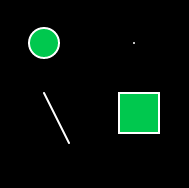
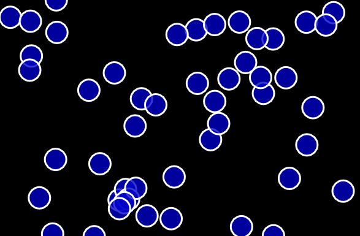
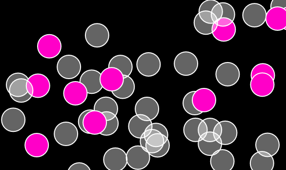
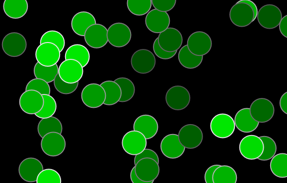
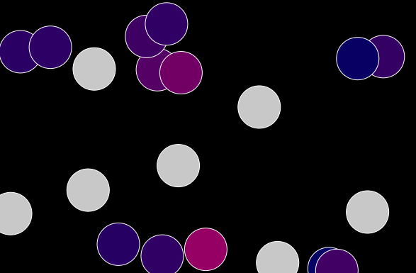

# p5.js-basic-examples
A few basic examples of p5.js functionality

[Shapes](https://github.com/mary-chapman/p5.js-basic-examples/tree/master/shapes)
These are a few examples of different shapes you can make in P5.js.

## [Clicking to add an object](https://github.com/mary-chapman/p5.js-basic-examples/tree/master/bubbles-click-created)
This example allows the user to click on the screen, and then a new object will be created in that location.

## [Clicking to change an object's color](https://github.com/mary-chapman/p5.js-basic-examples/tree/master/bubbles-click-change-color)
In this example, the user can click on an object and change it's color.

## [Objects with a lifespan](https://github.com/mary-chapman/p5.js-basic-examples/tree/master/bubbles-lifespan)
These objects only last for a certain amount of time.  Once there color is faded out, the object is deleted.

## [Colliding Objects](https://github.com/mary-chapman/p5.js-basic-examples/tree/master/bubbles-collision)
This examples explores collision.  When the objects collide with eachother, they start changing colors.

## [Bouncing ball](https://github.com/mary-chapman/p5.js-basic-examples/tree/master/bouncing-ball)
In this example the object moves back and forth horizantally between the left and right borders of the canvas.

